# Инструкция по установке hackintosh для Dell 7577

* [Описание](#description)
  + [Примечания](#notes)
  + [Характеристики ноутбука](#specs)
  + [Протестировано](#tested)
  + [Что работает](#whats-working)
  + [Известные проблемы](#known-bugs)
  + [Требования](#requirements)
* [Создание загрузочной флешки](#create-usb)
  + [В MacOS](#create-usb-macos)
  + [В Linux](#create-usb-linux)
  + [В Windows](#create-usb-windows)
* [Установка](#installation)
* [После установки](#post-installation)
  + [Установка Clover bootloader](#install-clover-bootloader)
  + [Заводим микрофон гарнитуры](#enable-headset-micro)
  + [Сброс кэшей](#clear-cache)
  + [Отключить гибернацию](#turn-off-hibernation)
  + [SMBIOS и iMessage](#smbios-and-imessage)
* [Проблемы и их решения](#troubleshooting)
  + [Шрифты выглядят размыто в Mojave](#mojave-blurry-fonts)
  + [После обновления пропал звук или перестали работать некоторые кексты](#kexts-after-update)
  + ["Рваный" скролл при использовании не Apple мыши](#smooth-scroll)
* [Использованные материалы](#references)
  + [Кексты](#kexts)

## <a name="description"></a> Описание

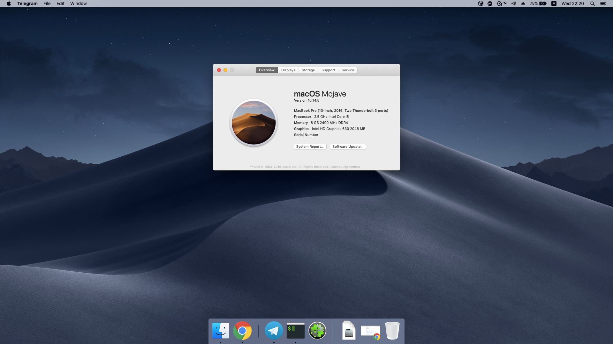

```plaintext
Clover USB Files:
 - drivers64UEFI: HFSPlus.efi (for HFS+ fs), apfs.efi (for apfs fs)

 - kexts/Other:
   - ApplePS2SmartTouchpad: For initial trackpad & keyboard support
   - FakeSMC: SMC emulator
   - RealtekRT8111: Kext for ethernet support
   - SATA-100-series-unsupported:
   - USBInjectAll: Injecting USB ports (even for recognizing the bootable USB)

 - config.plist: Initial SMBIOS, USBInjectAll dsdt patches, port limit patches (for usb 3.0)

----------------------------------

Clover Post-Install Files:
 - drivers64UEFI: HFSPlus.efi (for HFS+ fs), apfs.efi (for apfs fs)

 - /L/E Kexts:
   - ACPIBatteryManager: Kext for battery status
   - AppleBacklightFixup: Kext for backlight control
   - CodecCommander: Kext for solving 'no audio' after sleep
   - VoodooPS2Controller: Kext for keyboard

 - kexts/Other:
   - AppleALC: Kext for audio
   - AppleBacklightFixup: Kext for backlight control even in recovery
   - FakeSMC: SMC emulator
   - Lilu: Generic kext patches
   - RealtekRT8111: Kext for ethernet support
   - SATA-100-series-unsupported:
   - USBInjectAll: Injecting USB ports
   - VoodooI2C*: Kext for precision trackpad
   - VoodooPS2Controller: Kext for keyboard
   - WhateverGreen: Lilu plugin for various iGPU patches

 - config.plist:
   - DSDT Fixes: FixHPET, FixHeaders, FixIPIC, FixRTC, FixTMR
   - DSDT Patches: IGPU, IMEI, HDEF, OSI, PRW, VoodooI2C, brightness control patches
   - WhateverGreen properties: Disable unused ports, increase VRAM from 1536->2048 MB
   - Kernel and Kext Patches: DellSMBIOS, AppleRTC, KernelLapic, KernelPm
   - Kernel To Patch: MSR 0xE2, Panic kext logging
   - Kexts to Patch: I2C, SSD Trim, AppleALC patches
   - SMBIOS

 - patched:
   - SSDT-ALS0: Fake ambient light sensor
   - SSDT-BRT6: Brightness control via keyboard
   - SSDT-Disable_DGPU: Disable discrete GPU (Nvidia)
   - SSDT-I2C: VoodooI2C GPIO pinning & disabling VoodooPS2 kext for trackpads and mouses
   - SSDT-PNLF: Backlight ssdt
   - SSDT-PRW: SSDT for usb instant wake
   - SSDT-UIAC: Injecting right usb ports (coniguration for usbinjectall kext)
   - SSDT-XCPM: Injecting plugin-type for power management
   - SSDT-XOSI: Faking OS for the ACPI
   - SSDT_ALC256: CodecCommander config for ALC256 (removes headphone noise)
```

### <a name="notes"></a> Примечания

- Работающий хакинтош на 10.14 (Mojave) и 10.13.x (High Sierra)
- Нет поддрежки 4К дисплея *(у меня FullHD ноутбук)*. Но @Nihhaar считает что получится подключить с помощью `эти файлы` + `CoreDisplayFixup.kext` + `DVMT patch`

### <a name="specs"></a> Характеристики ноутбука

- Intel i5-7300HQ CPU (Kaby Lake)
- Intel HD Graphics 630 / nVidia GTX 1050
- 8GB 2400MHz DDR4 RAM
- 15.6" 1080p IPS Display
- Thunderbolt 3: PCI-E 2.0 x4 Intel JHL6340 (Alpine Ridge 2C 2016)
- Goodix GF3208 Fingerprint Sensor
- Intel 8265 WiFi
- Realtek ALC3246 Audio
- RTL8111 PCI Express Gigabit Ethernet Controller (rev 15)

### <a name="tested"></a> Протестировано

- [Конфигурация](#specs)
- 256GB Samsung 970 EVO M.2 SSD / 256GB Samsung 850 EVO SATA SSD
- macOS High Sierra / macOS Mojave
- Clover v2.4 r4988

### <a name="whats-working"></a> Что работает

- Аудио
    * Динамики
    * Наушники
    * Встроенный микрофон
    * Микрофон гарнитуры (см. [Заводим микрофон гарнитуры](#enable-headset-micro))
- Клавиатура
    * Подсветка клавиатуры
- Трэкпад
    * Жесты
    * Скролл
    * Драг & дроп
    * и т.д.
- USB (2.0 и 3.0)
- Thunderbolt port (см. [Известные проблемы](#known-bugs))
    * USB-C to USB
    * USB-C to HDMI
- Внешний монитор (через Thunderbolt порт)
- Ethernet
- Fn сочетания клавиш
    * Громкость
    * Яркость
    * Мультимедиа
    * и т.д.
- Сон
- CPU power management
- GPU acceleration и power management
- Web-камера
- Встроенный USB 2.0 кард-ридер
- Работа от батареи \ зарядка батареи
- TRIM для SSD
- Apple сервисы: iMessage, FaceTime, etc. (см. [SMBIOS и iMessage](#smbios-and-imessage))
- То что я забыл упомянуть 

### <a name="known-bugs"></a> Известные проблемы

- Не работает дискретная карта (нет способа завести Optimus на macOS)
- HDMI не работает, потому что он подключен к Nvidia карте, которую мы отключили
- Встроенный Wi-Fi не работает (нужно заменить модуль на совместимый, например *Dell DW1560 (на Broadcomm BCM94352Z)*)
- Не работает Thunderbolt hotplug
    * Если вставить устройство в порт до загрузки ОС, то оно увидится системой и будет работоспособно (USB-C to USB, USB-C to HDMI работают) если после загрузки системы устройство не отключать
- Не работает датчик отпечатка пальца

### <a name="requirements"></a> Требования

- Установить параметры BIOS:
  - Убрать галочку с *General -> Advanced Boot Options -> Enable Legacy Options ROMs*
  - Изменить *System Configuration -> SATA Operations* на AHCI
  - Изменить *Secure Boot -> Secure Boot Enable* на Disabled
  - Убрать галочку с *Virtualization Support -> VT for Direct I/O -> Enable VT for Direct I/O*
  - Поставить все галочки в *System Configuration -> Thunderbolt Adapter Configuration*
  - "Security level - No Security" в *System Configuration -> Thunderbolt Adapter Configuration*
- USB флешка размером >= 16GB, желательно USB 2.0 (с 3.0 у меня не получилось установить)

## <a name="create-usb"></a> Создание загрузочной флешки

Флешку стоит брать USB 2.0, так как установить систему c USB 3.0 у меня не получилось (в установленной системе будут работать оба стандарта). Если нет 2.0 флешки, то можно попробовать установить систему через USB 2.0 хаб (я не пробовал, но на форумах говорят что работает)

### <a name="create-usb-macos"></a> В MacOS

1. Вставить флешку в ноутбук
2. Вводим в терминал команду `diskutil list` и запоминаем номер флешки (diskX, где X - номер)
3. Создаем разделы: `diskutil partitionDisk /dev/diskX 2 MBR FAT32 "CLOVER EFI" 200Mi HFS+J "install_osx" R`
4. Копируем файлы для установки `sudo "/Applications/Install macOS Mojave.app/Contents/Resources/createinstallmedia" --volume /Volumes/install_osx`
5. [Скачиваем](https://sourceforge.net/projects/cloverefiboot/files/Installer/) последнюю версию Clover и запускаем установщик
6. Выбираем раздел *CLOVER EFI* для установки
7. Выбираем *Настроить* и отмечаем пункты
    - *Установить Clover только для UEFI загрузки* (*Установить Clover на раздел ESP* выберется автоматически)
    - *OSXAptioFix3Drv* (*Драйверы для UEFI загрузки* -> *Memory fix drivers*)
8. Начать установку
9. Раскладываем по своим местам файлы из директории *USB Files* этого репозитория

<details>
<summary>Пример</summary>

```plaintext
# serj @ MacBook-Pro-Serj in ~ [21:24:45]
$ diskutil list
/dev/disk0 (internal, physical):
   #:                       TYPE NAME                    SIZE       IDENTIFIER
   0:      GUID_partition_scheme                        *250.1 GB   disk0
   1:                        EFI EFI                     209.7 MB   disk0s1
   2:                 Apple_APFS Container disk2         249.8 GB   disk0s2

/dev/disk1 (internal):
   #:                       TYPE NAME                    SIZE       IDENTIFIER
   0:      GUID_partition_scheme                         250.1 GB   disk1
   1:                        EFI BOOT                    576.7 MB   disk1s1
   2:           Linux Filesystem                         249.5 GB   disk1s2

/dev/disk2 (synthesized):
   #:                       TYPE NAME                    SIZE       IDENTIFIER
   0:      APFS Container Scheme -                      +249.8 GB   disk2
                                 Physical Store disk0s2
   1:                APFS Volume MacOS                   50.2 GB    disk2s1
   2:                APFS Volume Preboot                 22.3 MB    disk2s2
   3:                APFS Volume Recovery                515.8 MB   disk2s3
   4:                APFS Volume VM                      20.5 KB    disk2s4
   5:                APFS Volume Steam                   9.7 GB     disk2s5

/dev/disk3 (external, physical):
   #:                       TYPE NAME                    SIZE       IDENTIFIER
   0:     FDisk_partition_scheme                        *31.5 GB    disk3
   1:             Windows_FAT_32 KINGSTON                31.5 GB    disk3s1

# serj @ MacBook-Pro-Serj in ~ [21:24:55]
$ diskutil partitionDisk /dev/disk3 2 MBR FAT32 "CLOVER EFI" 200Mi HFS+J "install_osx" R
Started partitioning on disk3
Unmounting disk
Creating the partition map
Waiting for partitions to activate
Formatting disk3s1 as MS-DOS (FAT32) with name CLOVER EFI
512 bytes per physical sector
/dev/rdisk3s1: 403266 sectors in 403266 FAT32 clusters (512 bytes/cluster)
bps=512 spc=1 res=32 nft=2 mid=0xf8 spt=32 hds=32 hid=2 drv=0x80 bsec=409600 bspf=3151 rdcl=2 infs=1 bkbs=6
Mounting disk
Formatting disk3s2 as Mac OS Extended (Journaled) with name install_osx
Initialized /dev/rdisk3s2 as a 29 GB case-insensitive HFS Plus volume with a 8192k journal
Mounting disk
Finished partitioning on disk3
/dev/disk3 (external, physical):
   #:                       TYPE NAME                    SIZE       IDENTIFIER
   0:     FDisk_partition_scheme                        *31.5 GB    disk3
   1:                 DOS_FAT_32 CLOVER EFI              209.7 MB   disk3s1
   2:                  Apple_HFS install_osx             31.3 GB    disk3s2

# serj @ MacBook-Pro-Serj in ~ [21:26:38]
$ sudo "/Applications/Install macOS Mojave.app/Contents/Resources/createinstallmedia" --volume /Volumes/install_osx
Password:
Ready to start.
To continue we need to erase the volume at /Volumes/install_osx.
If you wish to continue type (Y) then press return: Y
Erasing disk: 0%... 10%... 20%... 30%... 100%
Copying to disk: 0%... 10%... 20%... 30%... 40%... 50%... 60%... 70%... 80%... 90%... 100%
Making disk bootable...
Copying boot files...
Install media now available at "/Volumes/Install macOS Mojave"
```

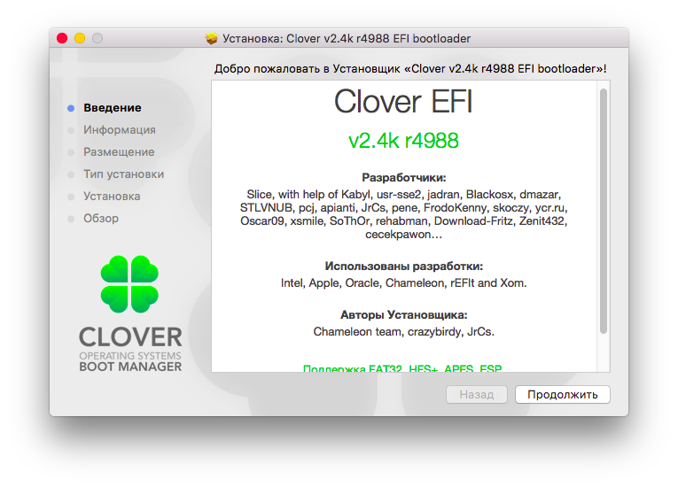

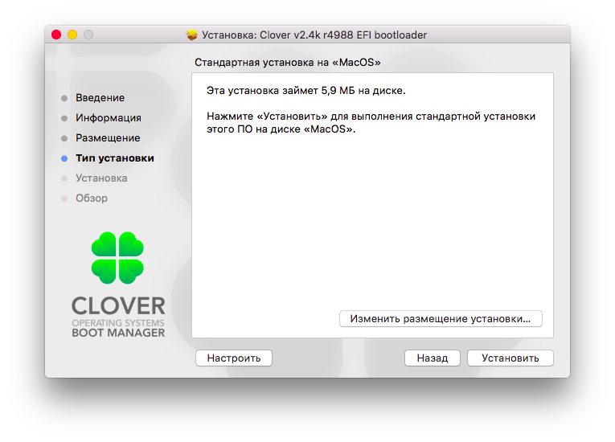

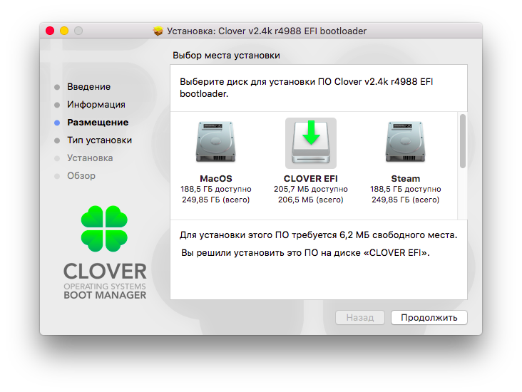

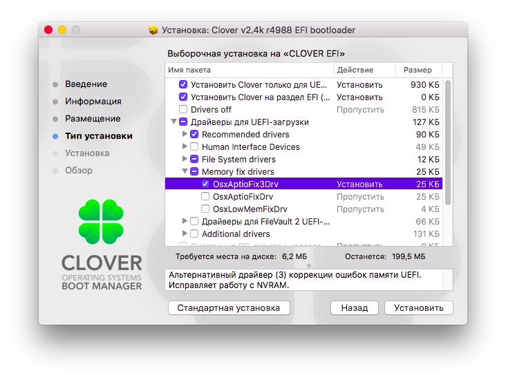

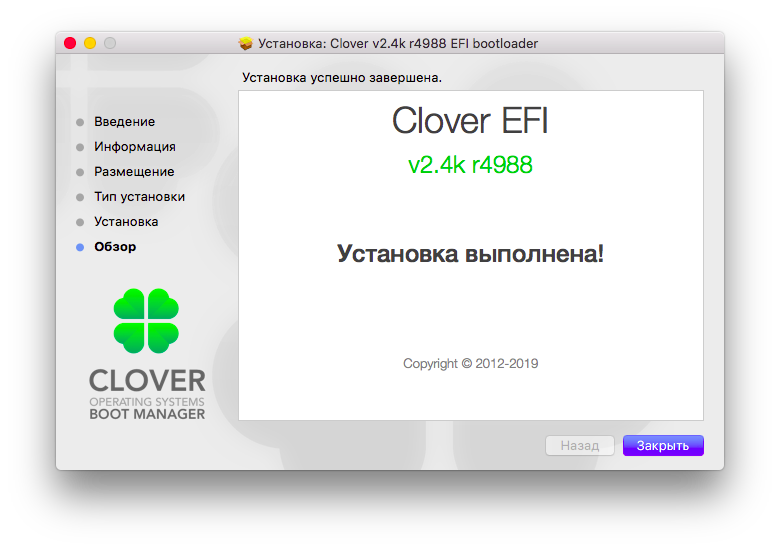

</details>

### <a name="create-usb-linux"></a> В Linux

1. Подключаем флешку
2. Скачиваем образ macOS [отсюда](https://mac-ru.net/viewtopic.php?t=1402), [отсюда](https://mac-ru.net/viewtopic.php?t=41), [отсюда](https://nnmclub.to/forum/viewtopic.php?t=1069291) или с [магнет-ссылки](http://магнит.tk/#magnet:?dn=BDUOSXDISTR&xt=urn:btih:64125b9f1387632e1b35b8da27eba422f9821d43) или из [меги](https://mega.nz/#!5wgzXQhR!uQHg6rSwJ5FH-oOWphm0HZxv1fqlaNfb1a_sKgzMjGI)
3. Распаковываем образ из архива.
4. Вводим команду `lsblk` и находим букву своей флешки (sdX, где X - буква флешки).
5. Создаем разделы - `fdisk /dev/sdX`. После ввода этой команды появится командный интерфейс программы *fdisk*
6. Вводим `o`. Это создаст новую MBR таблицу разделов
7. Создаем новый ESP раздел:
    - `n`
    - *Partition type*, *Partition number* и *First sector* оставляем по умолчанию (просто жмем enter)
    - *Last sector*: `+200M`
8. Меняем тип раздела на W95 (LBA):
    - `t`
    - *Hex code*: `c`
9. Создаем второй раздел под образ macOS:
    - `n`
    - *Partition type*, *Partition number*, *First sector*, *Last sector* оставляем по умолчанию
10. Сохраняем изменения: `w`
11. Форматируем Clover раздел: `mkfs.vfat -n "CLOVER EFI" -F32 /dev/sdX1`
12. [Скачиваем](https://sourceforge.net/projects/cloverefiboot/files/Bootable_ISO/) ISO образ Clover. Распаковываем сначала архив, а затем и сам iso образ.
13. Копируем *EFI*, *Library*, *usr* в корень *CLOVER EFI* раздела.
14. Из *EFI/CLOVER/drivers/off/* в *EFI/CLOVER/drivers/UEFI/* копируем:
    * ApfsDriverLoader.efi
    * AudioDxe.efimas
    * DataHubDxe.efi
    * FSInject.efi
    * OsxAptioFix3Drv.efi
    * SMCHelper.efi
15. Раскладываем по своим местам файлы из директории *USB Files* этого репозитория
16. Выполняем `dd bs=4M if=/путь/к/5.hfs of=/dev/sdX2 status=progress oflag=sync`
    >На этом шаге у вас уже должен быть скачан образ macOS в виде 5.hfs

<details>
<summary>Пример</summary>

```
# serj @ NEWTONE in ~ [23:40:23] 
$ lsblk
NAME                                                                                      MAJ:MIN RM   SIZE RO TYPE  MOUNTPOINT
sda                                                                                         8:0    0 232,9G  0 disk  
├─sda1                                                                                      8:1    0   200M  0 part  
└─sda2                                                                                      8:2    0 232,7G  0 part  
sdb                                                                                         8:16   1  29,3G  0 disk  
├─sdb1                                                                                      8:17   1  31,5G  0 part  
nvme0n1                                                                                   259:0    0 232,9G  0 disk  
├─nvme0n1p1                                                                               259:1    0   550M  0 part  /boot
└─nvme0n1p2                                                                               259:2    0 232,4G  0 part  
  └─luks                                                                                  254:0    0 232,4G  0 crypt 
    ├─vg0-swap                                                                            254:1    0     8G  0 lvm   [SWAP]
    ├─vg0-root                                                                            254:2    0    62G  0 lvm   /
    └─vg0-home                                                                            254:3    0 162,4G  0 lvm   /home

# serj @ NEWTONE in ~ [23:42:13] 
$ sudo fdisk /dev/sdb

Welcome to fdisk (util-linux 2.34).
Changes will remain in memory only, until you decide to write them.
Be careful before using the write command.


# Создаем новую MBR таблицу разделов
Command (m for help): o
Created a new DOS disklabel with disk identifier 0xcb7a20ce.

# Создаем новый EFI раздел
Command (m for help): n
Partition type
   p   primary (0 primary, 0 extended, 4 free)
   e   extended (container for logical partitions)
Select (default p):
Partition number (1-4, default 1):
First sector (2048-61457663, default 2048): 
Last sector, +/-sectors or +/-size{K,M,G,T,P} (2048-61457663, default 61457663): +200M

Created a new partition 1 of type 'Linux' and of size 200 MiB.

# Меняем тип раздела на EFI
Command (m for help): t
Selected partition 1
          
Hex code (type L to list all codes): c
Changed type of partition 'Linux' to 'W95 FAT32 (LBA)'.

# Создаем второй раздел для образа macOS
Command (m for help): n
Partition type
   p   primary (1 primary, 0 extended, 3 free)
   e   extended (container for logical partitions)
Select (default p):
Partition number (2-4, default 2): 
First sector (411648-61457663, default 411648): 
Last sector, +/-sectors or +/-size{K,M,G,T,P} (411648-61457663, default 61457663): 

Created a new partition 2 of type 'Linux' and of size 29,1 GiB.

# Записываем изменения
Command (m for help): w
The partition table has been altered.
Calling ioctl() to re-read partition table.
Syncing disks.

# serj @ NEWTONE in ~ [23:50:40] 
$ sudo mkfs.vfat -n CLOVER -F32 /dev/sdb1                       
mkfs.fat 4.1 (2017-01-24)

# serj @ NEWTONE in ~ [23:52:41] 
$ sudo dd bs=4M if=Downloads/5HFS_INSTALLAPP_MACOX_DISTR/WIN/5.hfs of=/dev/sdb2 status=progress oflag=sync
6249512960 bytes (6,2 GB, 5,8 GiB) copied, 386 s, 16,2 MB/s
1492+1 records in
1492+1 records out
6259073024 bytes (6,3 GB, 5,8 GiB) copied, 386,762 s, 16,2 MB/s
```

</details>

### <a name="create-usb-windows"></a> В Windows

1. Скачиваем *BootDiskUtility* [отсюда](http://cvad-mac.narod.ru/index/bootdiskutility_exe/0-5)
2. Распаковываем утилиту в любую папку.
3. Скачиваем образ macOS [отсюда](https://mac-ru.net/viewtopic.php?t=1402), [отсюда](https://mac-ru.net/viewtopic.php?t=41), [отсюда](https://nnmclub.to/forum/viewtopic.php?t=1069291) или с [магнет-ссылки](http://магнит.tk/#magnet:?dn=BDUOSXDISTR&xt=urn:btih:64125b9f1387632e1b35b8da27eba422f9821d43) или из [меги](https://mega.nz/#!5wgzXQhR!uQHg6rSwJ5FH-oOWphm0HZxv1fqlaNfb1a_sKgzMjGI)
4. Распаковываем образ из архива.
5. Открываем *BootDiskUtility*, заходим в секцию настроек, в *Clover bootloader source* выбираем *Not install* (В моем случае BDU неправильно распаковывала установщик, поэтому сделаем это вручную).
6. Выбираем свое USB-устройство, нажимаем *Format Drive*.
7. [Скачиваем](https://sourceforge.net/projects/cloverefiboot/files/Bootable_ISO/) ISO образ Clover. Распаковываем с помощью 7-zip сначала архив, а затем и сам iso образ.
8. Копируем *EFI*, *Library*, *usr* в корень *CLOVER EFI* раздела.
9. Из *EFI/CLOVER/drivers/off/* в *EFI/CLOVER/drivers/UEFI/* копируем:
    * ApfsDriverLoader.efi
    * AudioDxe.efi
    * DataHubDxe.efi
    * FSInject.efi
    * OsxAptioFix3Drv.efi
    * SMCHelper.efi
10. Раскладываем по своим местам файлы из директории *USB Files* этого репозитория
11. Нажимаем на значок `+` рядом с названием USB. Если вы ничего не меняли в настройках, то у вас появится два раздела, один из которых будет иметь название `CLOVER`, а другой `NONAME`
    >На этом шаге у вас уже должен быть скачан образ macOS в виде 5.hfs.
12. Выбираем `Part2`, который имеет название `NONAME`. Нажимаем кнопку Restore Partition и указываем прежде скачанный `5.hfs`. Начнется запись образа на USB.

<details>
<summary>Пример</summary>
    
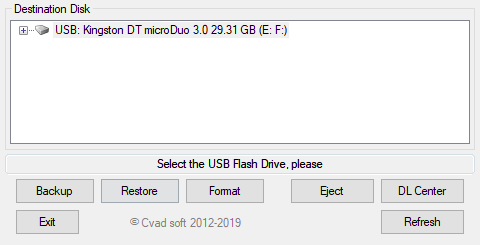

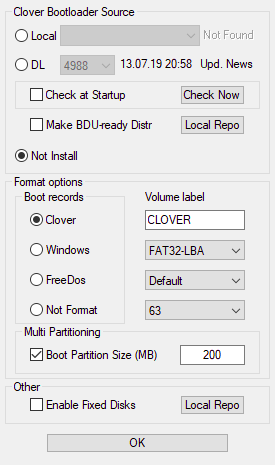

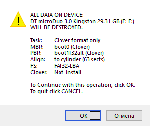

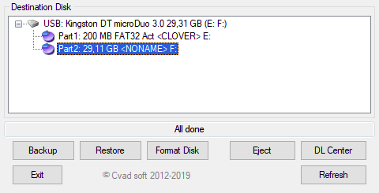

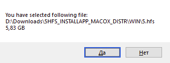

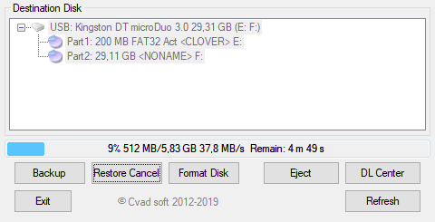
  
</details>

## <a name="installation"></a> Установка

- Во время загрузки ноутбука постоянно нажимайте F12, чтобы появилось *one-time boot-menu* в котором нужно выбрать созданную несколькими шагами ранее флешку
- Выберите *Boot macOS install from Install macOS High Sierra (или Mojave)* в Clover
- Ждем загрузки установщика запасшись терпением, потому что это занимает довольно много времени (5-10 минут)
- Откройте *Дисковую утилиту* и отформатируйте раздел в apfs (я выбираю регистрозависимую) и назначьте ему метку (например MacOS)
- Закройте *Дисковую утилиту* это вернет вас на первоначальный экран установки
- Выберите *Установка macOS*
- Начнется установка. По истечении некоторого времени ноубук самостоятельно перезагрузится (выглядит это будто установка прервалась, прогресс бар будет заполнен не полностью: это нормально)
- Опять заходим в *one-time boot-menu*. Тут появился новый вариант загрузки *macOS*, но он не работает и его можно удалить (в BIOS).
- Снова загружаемся с флешки, но теперь выберите *Boot macOS install from "Имя раздела, которое вы дали диску в Дисковой утилите"*
- Опять долго ждем загрузки и дожидаемся окончания установки, по окончании которой ноубук в очередной раз перезагрузится
- Снова грузимся с флешки, но теперь выбираем *Boot macOS from "Имя раздела, которое вы дали диску в Дисковой утилите"*
- Проходим первичную настройку системы. Шаг с входом с помощью Apple ID пропускаем.
- Теперь у вас есть ноутбук с macOS, но загрузиться в нее можно только с помощью загрузочной флешки. Чтобы исправить это выполните [следующую инструкцию](#install-clover-bootloader)

## <a name="post-installation"></a> После установки

В обязательном порядке нужно установить Clover на диск куда была установлена система, иначе грузиться прийдется только с флешки.
Если вам нужен работающий микрофон гарнитуры, тогда выполните действия [этой инструкции](#enable-headset-micro).
После выполнения этих действий нужно обязательно [сбросить кэши](#clear-cache).

### <a name="install-clover-bootloader"></a> Установка Clover bootloader

- Скачать [clover](https://sourceforge.net/projects/cloverefiboot/files/Installer/)
- Запустить установщик
- Сменить цель установки на "Раздел куда была установлена система"
- Выбрать *Настроить*
- Отметить *Установить Clover только для UEFI загрузки* (*Установить Clover на раздел ESP* выберется автоматически)
- Отметить *OSXAptioFix3Drv* (*Драйверы для UEFI загрузки* -> *Memory fix drivers*)
- Отметить *EmuVariableUefi* (*Драйверы для UEFI загрузки* -> *Additional drivers*)
- Отметить *Системные RC-скрипты целевого раздела* (*Install RC scripts on target volume*)
- Отметить *FileVault 2 UEFI drivers* (*Драйверы для UEFI загрузки*) (Опционально, если вы хотите в дальнейшем пользоваться этой возможностью)
- Раскладываем по своим местам файлы из директории *Post-Install Files* этого репозитория

### <a name="enable-headset-micro"></a> Заводим микрофон гарнитуры

- Клонируем [репозиторий](https://github.com/hackintosh-stuff/ComboJack.git)
- Выполняем инструкции из README

### <a name="clear-cache"></a> Сброс кэшей

- Запустить *Scripts/fixPermissions.sh* с правами суперпользователя, чтобы исправить kext permissions
- Перезагрузить ноутбук с `-f` флагом (Options -> Boot args в Clover)
- Пересобрать кэш командой `sudo kextcache -i /`
- Перезагрузить ноутбук  

### <a name="turn-off-hibernation"></a> Отключить гибернацию

```bash
sudo pmset -a hibernatemode 0
sudo rm /var/vm/sleepimage
sudo mkdir /var/vm/sleepimage
sudo pmset -a standby 0
sudo pmset -a autopoweroff 0
sudo pmset -a powernap 0
```

### <a name="smbios-and-imessage"></a> SMBIOS и iMessage

Инструкция по настройке SMBIOS, после выполнения которой заработают iMessage, FaceTime и тд. [An iDiot's Guide To iMessage](https://www.tonymacx86.com/threads/an-idiots-guide-to-imessage.196827/)

## <a name="troubleshooting"></a> Проблемы и их решения

### <a name="mojave-blurry-fonts"></a> Шрифты выглядят размыто в Mojave

- Из-за субпиксельного сглаживания, которое включено по умолчанию в Mojave шрифты на не-retina дисплеях выглядят размыто
- Эти действия заставят шрифты выглядеть немного лучше:
    ```
    # Введите эти команды в терминале и перезагрузите ноутбук

    defaults write -g CGFontRenderingFontSmoothingDisabled -bool NO
    defaults -currentHost write -globalDomain AppleFontSmoothing -int 2
    ```
- Чтобы откатить изменения:
    ```
    # Введите эти команды в терминале и перезагрузите ноутбук

    defaults -currentHost delete -globalDomain AppleFontSmoothing
    defaults write -g CGFontRenderingFontSmoothingDisabled -bool YES
    ```

### <a name="kexts-after-update"></a> После обновления пропал звук или перестали работать некоторые кексты

- Необходимо [сбросить кэши](#clear-cache)

### <a name="smooth-scroll"></a> "Рваный" скролл при использовании не Apple мыши

- Используйте эту программу: https://mos.caldis.me
- Включить/выключить реверс при скролле можно тоже через нее

## <a name="references"></a> Использованные материалы

1. [GitHub - Nihhaar/Hackintosh-Dell-7567](https://github.com/Nihhaar/Hackintosh-Dell-7567)
2. [GitHub - hackintosh-stuff/ComboJack](https://github.com/hackintosh-stuff/ComboJack)
3. [Установка Mac OS X на Intel-PC](https://telegra.ph/Ustanovka-Mac-OS-X-na-Intel-PC-08-18-2)
4. [GitHub - meixiaofei/Dell7570_MacOs_Clover](https://github.com/meixiaofei/Dell7570_MacOs_Clover)
5. [[Guide] Booting the OS X installer on LAPTOPS with Clover](https://www.tonymacx86.com/threads/guide-booting-the-os-x-installer-on-laptops-with-clover.148093/)
6. [[Guide] Dell Inspiron 15 7567 (and similar) (Near-Full Functionality)](https://www.tonymacx86.com/threads/guide-dell-inspiron-15-7567-and-similar-near-full-functionality.234988/)
7. [How to create a bootable installer for macOS](https://support.apple.com/en-us/HT201372)
8. [How to install Clover Bootloader on USB from Windows and Linux](https://www.aioboot.com/en/clover-bootloader-windows/)
9. [An iDiot's Guide To iMessage](https://www.tonymacx86.com/threads/an-idiots-guide-to-imessage.196827/)
10. [[Guide] Intel Framebuffer patching using WhateverGreen](https://www.tonymacx86.com/threads/guide-intel-framebuffer-patching-using-whatevergreen.256490/)

### <a name="kexts"></a> Кексты

- ACPIBatteryManager [RehabMan-Battery-2018-1005.zip (1.90.1)](https://bitbucket.org/RehabMan/os-x-acpi-battery-driver/downloads/)
- AppleBacklightFixup [RehabMan-BacklightFixup-2018-1013.zip (1.0.2)](https://bitbucket.org/RehabMan/applebacklightfixup/downloads/)
- CodecCommander [RehabMan-CodecCommander-2018-1003.zip (2.7.1)](https://bitbucket.org/RehabMan/os-x-eapd-codec-commander/downloads/)
- VoodooPS2Controller [RehabMan-Voodoo-2018-1008.zip (1.9.2)](https://bitbucket.org/RehabMan/os-x-voodoo-ps2-controller/downloads/)

- AppleALC [1.3.9](https://github.com/acidanthera/AppleALC/releases)
- FakeSMC [RehabMan-FakeSMC-2018-0915.zip (6.26-357-gceb835ea.1800)](https://bitbucket.org/RehabMan/os-x-fakesmc-kozlek/downloads/)
- Lilu [1.3.7](https://github.com/acidanthera/Lilu/releases)
- RealtekRTL8111 [2.2.2](https://github.com/Mieze/RTL8111_driver_for_OS_X/releases)
- USBInjectAll [RehabMan-USBInjectAll-2018-1108.zip (0.7.1)](https://bitbucket.org/RehabMan/os-x-usb-inject-all/downloads/)
- VoodooI2C & VoodooI2CHID [2.1.4](https://github.com/alexandred/VoodooI2C/releases)
- WhateverGreen [1.3.0](https://github.com/acidanthera/WhateverGreen/releases)
